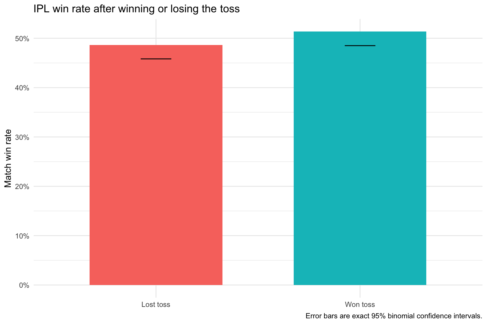
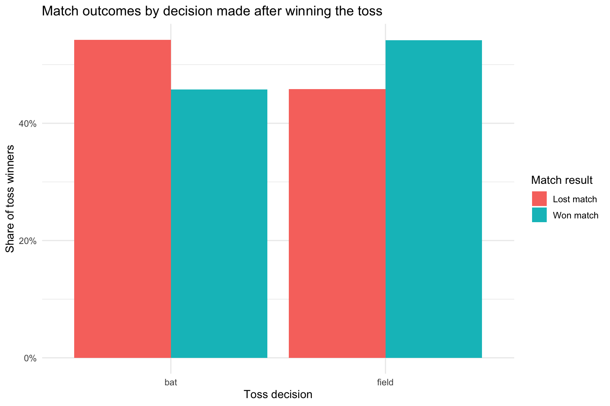
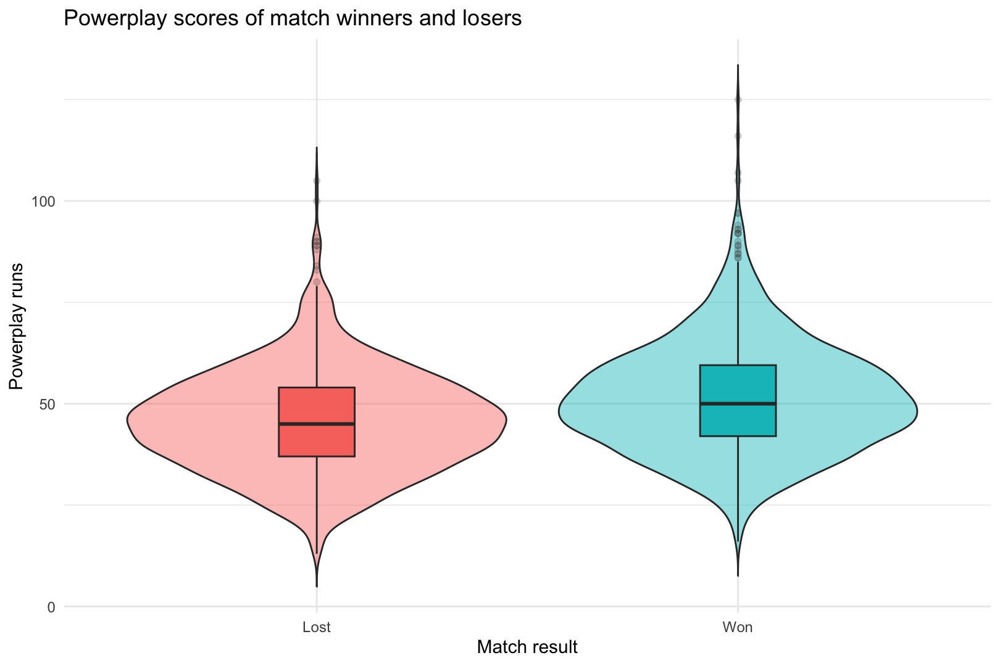
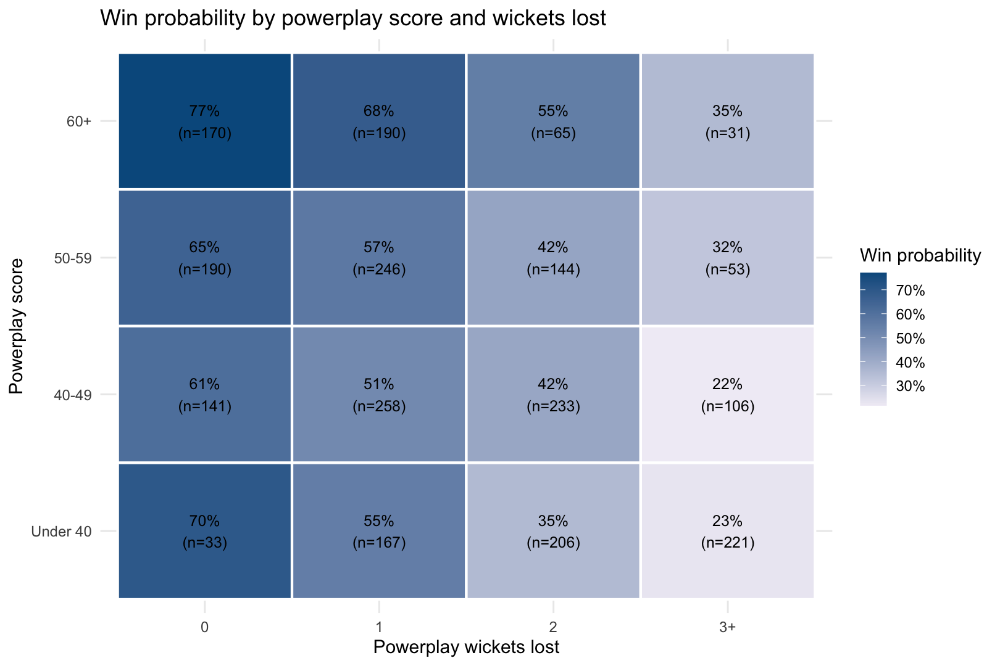
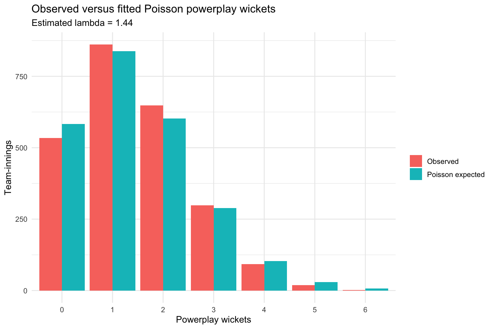
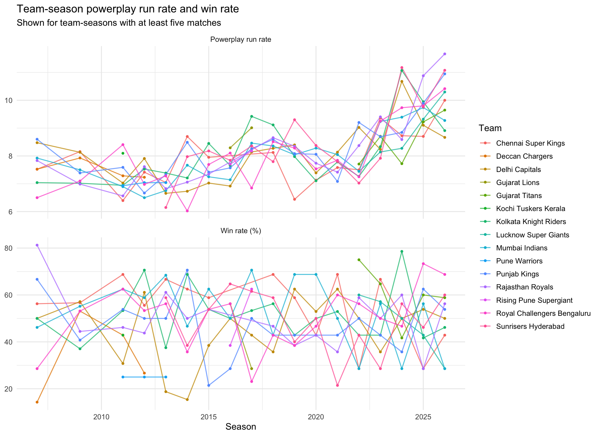
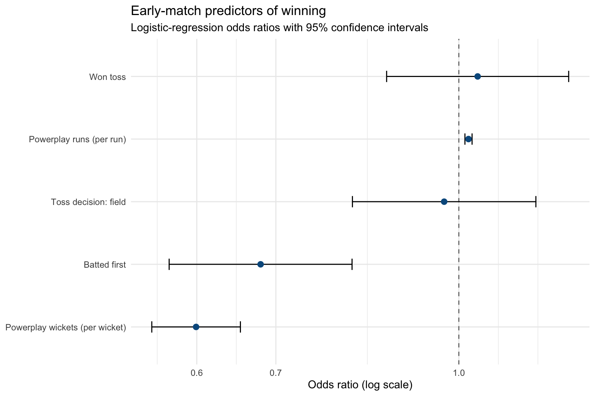

```{r setup, include=FALSE}
knitr::opts_chunk$set(echo = FALSE, warning = FALSE, message = FALSE)
library(knitr)
data <- read.csv("output/data/ipl_powerplay_match_level.csv")
desc <- read.csv("output/tables/descriptive_statistics.csv")
probs <- read.csv("output/tables/conditional_probabilities.csv")
tests <- read.csv("output/tables/hypothesis_tests.csv")
ci <- read.csv("output/tables/toss_win_probability_ci.csv")
model <- read.csv("output/tables/logistic_regression_odds_ratios.csv")
quality <- read.csv("output/tables/data_quality_checks.csv")
```

# Aim and problem statement

Commentators often claim that the first six overs create momentum and decide a
T20 match. This observational study tests how toss outcome, toss decision,
powerplay runs, and powerplay wickets are associated with the probability of
winning an IPL match.

# Domain theory

The first six overs form the powerplay, when fielding restrictions create
scoring opportunities but aggressive batting can also cost wickets. The model
uses only information known by the end of a team's powerplay; it does not use
final innings totals or winning margins as predictors.

# Data description and reference

The source is Cricsheet's IPL ball-by-ball JSON data. The analysis contains
`r length(unique(data$match_id))` completed matches and `r nrow(data)` team-match
observations. Each match contributes one winner and one loser.

Source: Cricsheet, *Available match data downloads*,
<https://cricsheet.org/downloads/>.

# Data cleaning

The pipeline excludes matches without a winner, resolves tied games from the
recorded eliminator winner, ignores Super Over innings, standardizes renamed
teams, and aggregates all deliveries in overs 0 through 5. Wides and no-balls
do not count as legal balls when calculating run rate. Retired-hurt dismissals
do not count as wickets lost.

```{r}
kable(quality, caption = "Automated data-quality checks")
```

# Data implementation

The reproducible implementation is in `R/01_analysis.R`. It reads the original
JSON without modifying it and saves the analysis-ready table as
`output/data/ipl_powerplay_match_level.csv`.

# Data analysis

## Descriptive statistics

Kurtosis is reported as Pearson kurtosis (a normal distribution has kurtosis
3), rather than excess kurtosis.

```{r}
kable(desc, digits = 3, caption = "Powerplay-run descriptive statistics")
```

## Toss and conditional probability

The estimated probability of winning given a toss win is
`r sprintf('%.1f%%', 100 * probs$p_win_given_toss_win)`, with an exact 95%
confidence interval of `r sprintf('%.1f%% to %.1f%%', 100 * ci$lower_95,
100 * ci$upper_95)`. The estimated probability of winning after scoring at
least 50 powerplay runs is
`r sprintf('%.1f%%', 100 * probs$p_win_given_high_powerplay_score)`.

```{r, out.width='82%', fig.align='center'}


```

## Powerplay scoring and wickets

```{r, out.width='82%', fig.align='center'}



```

## Hypothesis tests

All tests use a 5% significance level. For the t-test, the alternative is that
winners have a higher mean powerplay score. The Poisson test combines counts of
three or more wickets so its expected cells remain sufficiently large.

```{r}
kable(tests, digits = 4, caption = "Hypothesis-test results")
```

## Team-season patterns

```{r, out.width='92%', fig.align='center'}

```

## Logistic regression

The binary logistic model predicts a team-match win from toss result, toss
decision, batting order, powerplay runs, and powerplay wickets. Odds ratios
above one indicate higher estimated win odds, holding the other variables
constant.

```{r}
kable(model, digits = 4, caption = "Logistic-regression coefficients and odds ratios")
```

```{r, out.width='82%', fig.align='center'}

```

# Conclusion

Winning the toss was **not** significantly associated with winning the match
in this sample (chi-square p = `r format.pval(tests$p_value[1], digits = 3)`).
Winners scored significantly more powerplay runs on average (one-sided Welch
t-test p = `r format.pval(tests$p_value[2], digits = 3)`), while powerplay
wickets did not closely follow a Poisson distribution (goodness-of-fit p =
`r format.pval(tests$p_value[3], digits = 3)`). In the adjusted logistic model,
each additional powerplay run multiplied the estimated win odds by
`r sprintf('%.3f', model$odds_ratio[model$term == 'powerplay_runs'])`, while
each additional powerplay wicket multiplied them by
`r sprintf('%.3f', model$odds_ratio[model$term == 'powerplay_wickets'])`.
Powerplay wickets showed the strongest statistical association in the model,
judged by the absolute z-statistic.

These are associations, not causal effects. Team strength, venue, opposition,
season, and match situation can influence both powerplay performance and the
eventual result. Findings therefore apply to this IPL sample and should not
automatically be generalized to other competitions or formats.
